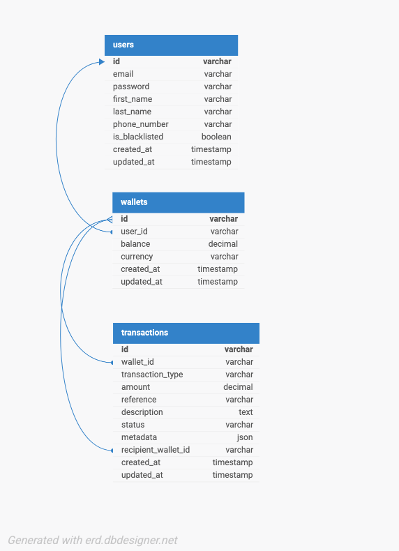

# Demo Credit Wallet Service

A robust RESTful API for Demo Credit - a mobile lending app wallet service built for the Lendsqr Backend Engineering Assessment.

[](https://www.typescriptlang.org/)
[](https://nodejs.org/)
[](https://www.mysql.com/)
[](https://github.com/marvelousajuzie/marvelousajuzie-lendsqr-be-test)

**Live API:** `https://marvelousajuzie-lendsqr-be-test.onrender.com`  
**Developer:** Marvelous Ajuzie

---

## ✨ Features

- 🔐 User authentication with JWT
- 🚫 Karma blacklist verification (Lendsqr Adjutor API)
- 💰 Wallet operations: fund, withdraw, transfer
- 📊 Transaction history with audit trail
- 🔒 ACID-compliant database transactions
- ✅ 17 comprehensive unit tests
- 🛡️ Bcrypt password hashing & input validation

---

## 🛠 Tech Stack

**Backend:** Node.js (TypeScript) • Express.js  
**Database:** MySQL • Knex.js ORM  
**Auth:** JWT • Bcrypt  
**Testing:** Jest  
**Validation:** Joi

---

## 📊 Database Design

### E-R Diagram



### Schema Overview

**users** (1:1) → **wallets** (1:N) → **transactions**

- **users**: Authentication & profile (email, password, phone, blacklist status)
- **wallets**: Balance management (one per user, NGN currency)
- **transactions**: Immutable audit trail (credit/debit/transfer)

**Key Design Features:**
- UUIDs for all primary keys (security & scalability)
- Unique transaction references (idempotency)
- Foreign key constraints with CASCADE/SET NULL
- CHECK constraints (balance ≥ 0, amount > 0)

---

## 🏗 Architecture

**Layered Architecture:**
```
Routes → Controllers → Services → Models → Database
```

**Why?**
- ✅ Separation of concerns
- ✅ Easy to test (mocked dependencies)
- ✅ SOLID principles
- ✅ Reusable business logic

**Transaction Scoping:**
```typescript
await db.transaction(async (trx) => {
  // 1. Create transaction record
  // 2. Update wallet balance
  // 3. Mark as successful
  // All-or-nothing atomicity
});
```

---

## 📡 API Endpoints

**Base URL:** `https://marvelousajuzie-lendsqr-be-test.onrender.com/api/v1`

### Authentication

| Method | Endpoint | Description |
|--------|----------|-------------|
| POST | `/auth/register` | Register new user |
| POST | `/auth/login` | Login user |

### Wallet Operations (Protected)

| Method | Endpoint | Description |
|--------|----------|-------------|
| GET | `/wallet/balance` | Get wallet balance |
| POST | `/wallet/fund` | Add funds to wallet |
| POST | `/wallet/withdraw` | Withdraw funds |
| POST | `/wallet/transfer` | Transfer to another user |

### Transactions (Protected)

| Method | Endpoint | Description |
|--------|----------|-------------|
| GET | `/transactions` | Get transaction history |

**Authentication:** All protected routes require:
```
Authorization: Bearer <your_jwt_token>
```

### Example Requests

**Register:**
```bash
curl -X POST https://marvelousajuzie-lendsqr-be-test.onrender.com/api/v1/auth/register \
  -H "Content-Type: application/json" \
  -d '{
    "email": "user@example.com",
    "password": "SecurePass123!",
    "first_name": "John",
    "last_name": "Doe",
    "phone_number": "+2348012345678"
  }'
```

**Fund Wallet:**
```bash
curl -X POST https://marvelousajuzie-lendsqr-be-test.onrender.com/api/v1/wallet/fund \
  -H "Authorization: Bearer YOUR_TOKEN" \
  -H "Content-Type: application/json" \
  -d '{"amount": 10000, "description": "Salary"}'
```

**Transfer:**
```bash
curl -X POST https://marvelousajuzie-lendsqr-be-test.onrender.com/api/v1/wallet/transfer \
  -H "Authorization: Bearer YOUR_TOKEN" \
  -H "Content-Type: application/json" \
  -d '{
    "recipient_email": "recipient@example.com",
    "amount": 5000,
    "description": "Loan repayment"
  }'
```

---

## 🚀 Quick Start

### Prerequisites
- Node.js 20.x+
- MySQL 8.x
- npm/yarn

### Installation
```bash
# Clone repository
git clone https://github.com/marvelousajuzie/marvelousajuzie-lendsqr-be-test.git
cd marvelousajuzie-lendsqr-be-test

# Install dependencies
npm install

# Setup environment variables
cp .env.example .env
# Edit .env with your credentials

# Create database
mysql -u root -p -e "CREATE DATABASE demo_credit_wallet;"

# Run migrations
npm run migrate

# Start development server
npm run dev
```

Server runs at `http://localhost:3000`

---

## 🧪 Testing
```bash
# Run all tests
npm test

# Watch mode
npm run test:watch

# Coverage report
npm test -- --coverage
```

**Test Results:**
- ✅ 17 tests passing
- ✅ KarmaService: 3 tests
- ✅ WalletService: 8 tests
- ✅ AuthService: 6 tests

---

## 🔐 Environment Variables
```env
NODE_ENV=development
PORT=3000

# Database
DB_HOST=localhost
DB_PORT=3306
DB_USER=root
DB_PASSWORD=your_password
DB_NAME=demo_credit_wallet

# JWT
JWT_SECRET=your-secret-key
JWT_EXPIRES_IN=24h

# Lendsqr Karma API
KARMA_BASE_URL=https://adjutor.lendsqr.com/v2/verification/karma
KARMA_API_KEY=your_karma_api_key
```

---

## 📁 Project Structure
```
src/
├── config/         # Database & env configuration
├── controllers/    # Request handlers
├── middlewares/    # Auth, validation, error handling
├── models/         # Database models (Knex)
├── routes/         # API routes
├── services/       # Business logic
├── validators/     # Joi schemas
├── utils/          # Helper functions
├── types/          # TypeScript definitions
├── tests/          # Unit & integration tests
└── database/       # Migrations

docs/
└── er-diagram.png  # Database schema diagram
```

---

## 🎯 Key Design Decisions

### 1. **Fail-Open Karma Strategy**
If Karma API is down, allow registration (availability over strict verification).

### 2. **UUID Primary Keys**
Security (non-sequential), scalability (distributed systems), no collision risk.

### 3. **Transaction Idempotency**
Unique `reference` field prevents duplicate processing of same request.

### 4. **Service Layer Pattern**
Business logic isolated from HTTP layer → testable, reusable, maintainable.

### 5. **Database Transactions**
All financial operations wrapped in DB transactions → ACID guarantees.

---

## 🔒 Security Features

- 🔐 Bcrypt password hashing (10 salt rounds)
- 🎫 JWT token authentication
- ✅ Joi input validation
- 🛡️ SQL injection prevention (Knex parameterized queries)
- 🚫 Sensitive data never in responses
- 🔑 Environment variables for secrets

---

## 📝 Assessment Requirements Checklist

- ✅ User account creation
- ✅ Fund wallet
- ✅ Transfer funds between users
- ✅ Withdraw funds
- ✅ Karma blacklist verification
- ✅ TypeScript implementation
- ✅ MySQL database
- ✅ Knex.js ORM
- ✅ Unit tests (positive & negative scenarios)
- ✅ README with E-R diagram
- ✅ Clean commit history
- ✅ Deployed to production

---

## 🌐 Deployment

**Platform:** Render.com  
**URL:** https://marvelousajuzie-lendsqr-be-test.onrender.com  
**Database:** MySQL (Render/PlanetScale)

---

## 👨‍💻 Author

**Marvelous Ajuzie**  
📧 Email: [your.email@example.com](mailto:your.email@example.com)  
🐙 GitHub: [@marvelousajuzie](https://github.com/marvelousajuzie)  
🔗 LinkedIn: [linkedin.com/in/marvelousajuzie](https://linkedin.com/in/marvelousajuzie)

---

## 🙏 Acknowledgments

Built for **Lendsqr Backend Engineering Assessment** • January 2025

---

## 📄 License

ISC